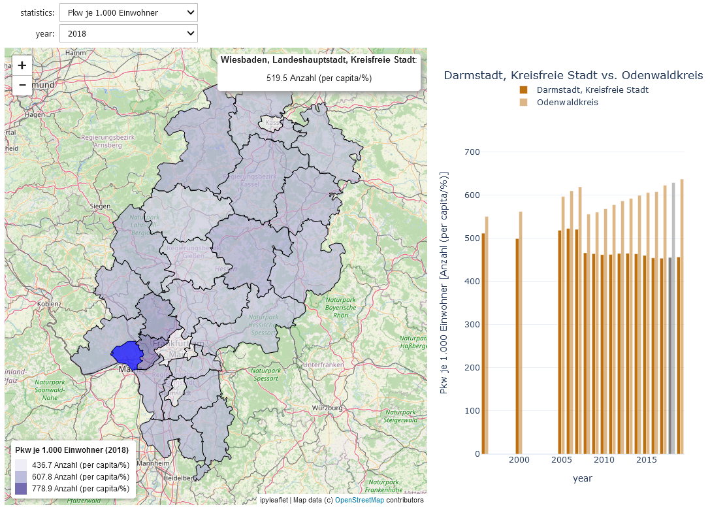

# Datenguide viz

Datenguide viz displays various **statistics about German districts of the state of Hesse**. You can compare different years and regions of the state on a map.

Datenguide viz is a voila app showing a Jupyter notebook that employs the **[datenguidepy](https://github.com/CorrelAid/datenguide-python)** package.

You can **start Datenguide viz** as a standalone application via binder here. If the binder is not in the cache, it will be built for you, which may take a bit.

If the application should not start (we experienced server issues in the past) please follow this link instead to run the app in a jupyter notebook.  

## Preview (non-interactive)

## CorrelAidX Challenge 2020

This app was developed by the Team Local Chapter Rhein-Main in the CorrelAidX Challenge 2020 (August to September 2020).

## Running the app locally

You can run the Datenguide viz app on your computer in Jupyter if you have the Python packages listed in `requirements.in` installed. The required packages can be installed using pip or conda.

The required map data is included in this repo as a GeoJSON file. The data to be visualized is queried at startup from datenguidepy.

## Extending the app

The Datenguide viz app currently visualizes the districts of Hesse state and includes a small number of potentially interesting statistics from datenguidepy. Feel free to clone the repo and add other statistics (explore them using notebooks/check_stats.ipynb) or extend the app to other federal states like neighboring Thuringia!
